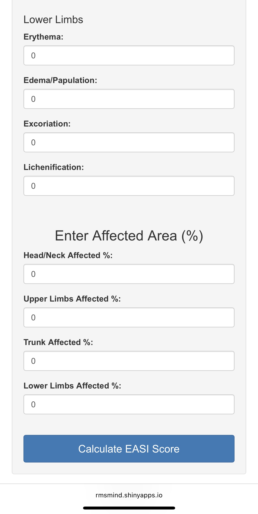

# 🧴 EASI Score Calculator – R Shiny App

This R Shiny app calculates the **Eczema Area and Severity Index (EASI)**, a standardized tool used by dermatologists to evaluate the severity of eczema (atopic dermatitis). It is designed to support clinical use in both research and real-world settings.

---

## 🧠 Purpose

This tool simplifies the manual process of computing EASI scores by providing a clean, responsive interface where users can input severity ratings and affected areas by region:

- Head/Neck
- Trunk
- Upper Limbs
- Lower Limbs

It is **fully mobile- and tablet-optimized**, allowing **doctors and research staff** to calculate EASI scores during in-person assessments without needing a desktop setup.

---

## ⚙️ Built With

- **R** and **Shiny**
- `reactive()` logic for live score updates
- Minimalist UI with clinical workflows in mind
- Responsive layout for mobile/tablet use

---

## 🌐 Live App

👉 [Launch the EASI Score Calculator](https://rmsmind.shinyapps.io/easi/)

---

## 🖼 Screenshots

**1. Homepage Input Interface**  

**2. Score Calculation Output**  

**3. Mobile-Friendly Layout**  
The app is designed for easy use on **tablets and smartphones** by doctors and research staff during bedside or in-clinic assessments.  

---

## 📚 Calculation Method Reference

This app is based on the scoring method described by:  
👉 [DermNet NZ – EASI Score Overview](https://dermnetnz.org/topics/easi-score)

It reflects the standard EASI calculation used in clinical trials and dermatology guidelines.

---

## 📁 Files Included

| File | Description |
|------|-------------|
| `app.R` | R Shiny source code |
| `EASI-App.jpg` | Input interface |
| `EASI-App2.jpg` | Output results view |
| `EASI-App3.jpg` | Mobile layout |
| `README.md` | Project documentation and references |

---

📌 *Created by Jorge Juarez – M.S. Applied Statistics Student @ University of Oklahoma*
